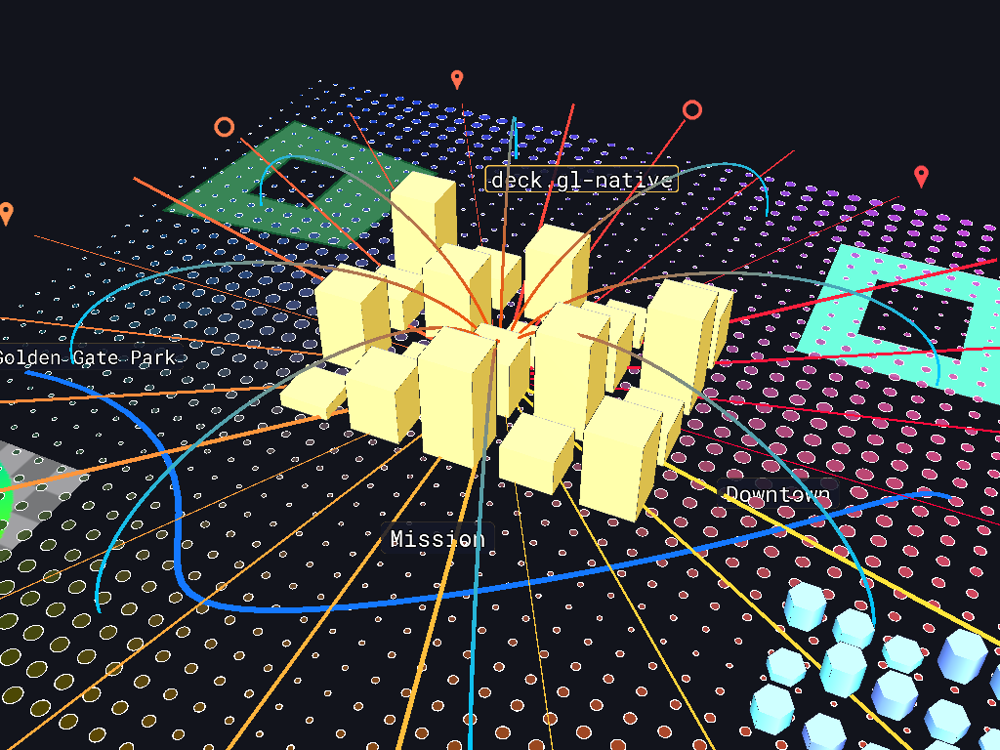
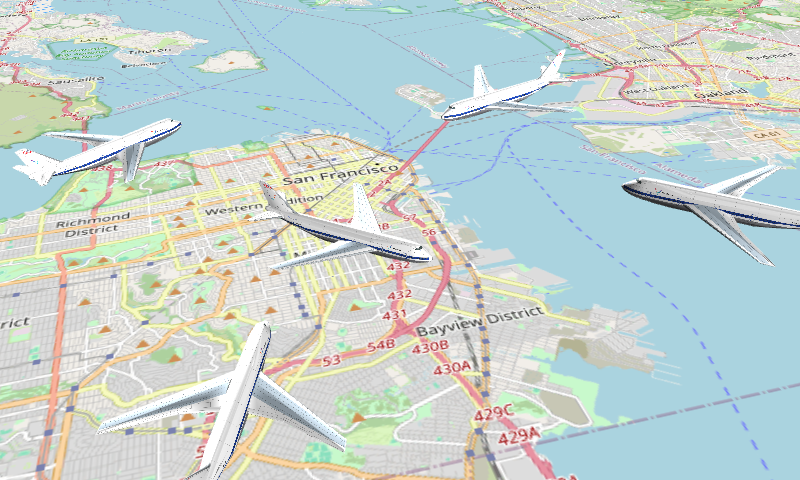
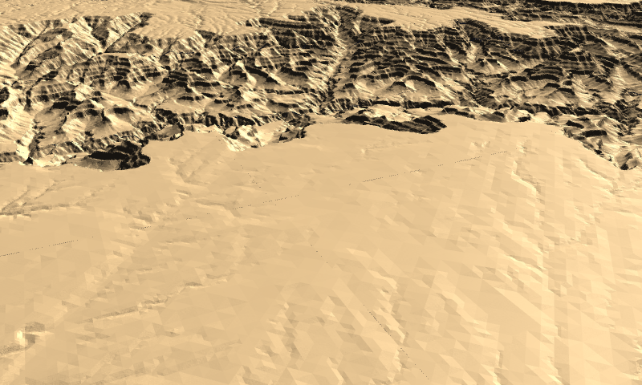
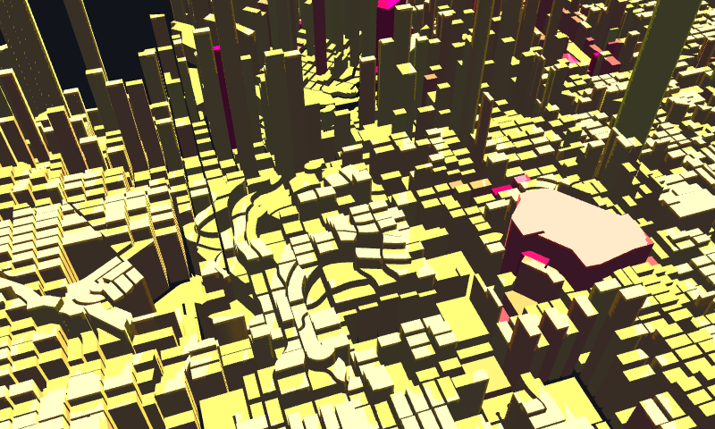
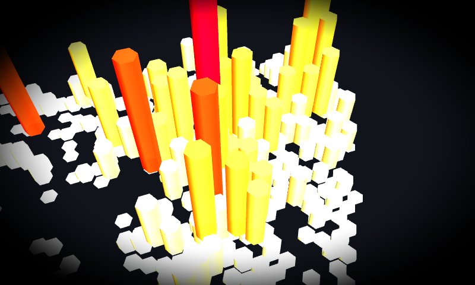
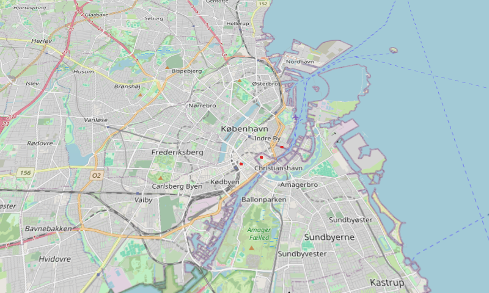
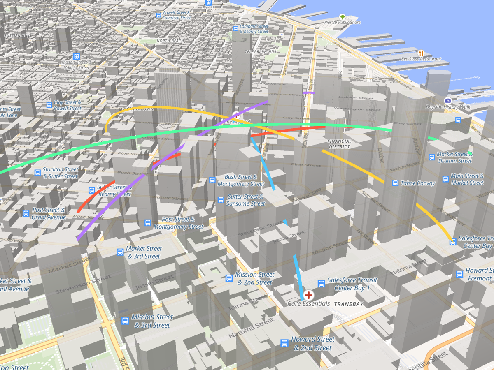

# deck.gl-native

A native implementation of [deck.gl](https://deck.gl) for native hardware: Rust on
[wgpu](https://wgpu.rs), rendering with deck.gl's own WGSL shaders and taking Apache Arrow
and GeoArrow data directly.



*The built-in example scene, rendered headless by `cargo run --release --bin texture_render`.*

This is an independent project by [Birk Skyum](https://github.com/birkskyum). It is not
affiliated with Unfolded, vis.gl or the deck.gl maintainers, although it builds on their work:
the layer designs, the WGSL shaders and the projection math are ports of
[deck.gl](https://github.com/visgl/deck.gl) and [luma.gl](https://github.com/visgl/luma.gl),
and the repository started from the 2020 C++ prototype that Unfolded, Inc. published as
[UnfoldedInc/deck.gl-native](https://github.com/UnfoldedInc/deck.gl-native). That prototype
is kept in `cpp/` as a reference and described in [docs/cpp-prototype.md](docs/cpp-prototype.md).
The Rust port in `crates/` is a fresh port of deck.gl 9 and is the active code base.

Planned work is tracked in the [roadmap issue](https://github.com/birkskyum/deck.gl-native/issues/75)
and the [issue list](https://github.com/birkskyum/deck.gl-native/issues).

## Gallery

Every picture below is a JSON description in `examples/json/`, rendered with
`cargo run --release --bin json_render -- examples/json/<name>.json out.png`.

| | |
| --- | --- |
|  |  |
| `ScenegraphLayer`: glTF models with a heading each, over a `TileLayer` basemap | `TerrainLayer`: elevation tiles triangulated with Martini, lit by a directional light |
|  |  |
| Shadow maps from a low sun over Vancouver's extruded blocks | `HexagonLayer` under two `PostProcessEffect` passes, a vignette and a saturation boost |
|  |  |
| `TileLayer`: a frustum culled quadtree loading raster tiles in the background | `GeoJsonLayer`: 4,600 extruded blocks read from GeoJSON |

## Status

**Layers.** Ports of `@deck.gl/layers`, `@deck.gl/aggregation-layers`, `@deck.gl/geo-layers`
and `@deck.gl/mesh-layers`, all verified pixel by pixel in headless GPU tests:

| Group | Layers |
| --- | --- |
| Core | `ScatterplotLayer`, `LineLayer`, `SolidPolygonLayer` (filled, extruded, wireframe, holes), `PathLayer` (joints, caps, billboard), `ArcLayer`, `BitmapLayer`, `IconLayer`, `TextLayer` (font atlas from any TrueType font, SDF outlines, backgrounds, wrapping), `ColumnLayer`, `GridCellLayer`, `PointCloudLayer` |
| Composite | `PolygonLayer`, `GeoJsonLayer` |
| Aggregation | `HexagonLayer`, `GridLayer`, `ScreenGridLayer` (CPU binning, sum/mean/min/max/count, quantize/linear/quantile/ordinal scales, percentile cutoffs), `HeatmapLayer` (GPU weights texture, colour ramp), `ContourLayer` (marching squares isolines and isobands) |
| Geo | `TileLayer` (frustum culled quadtree, best available refinement, cache, background loading), `MVTLayer` (a dependency free Mapbox Vector Tile decoder), `WMSLayer`, `TerrainLayer` (Martini meshes from elevation tiles, Mapbox Terrain-RGB and Terrarium decoders), `Tile3DLayer` (3D Tiles: screen space error traversal, `b3dm` and glTF tiles placed as metre offsets), `TripsLayer`, `GreatCircleLayer`, `H3HexagonLayer`, `H3ClusterLayer` (sets of cells merged into one outline), `S2Layer`, `A5Layer`, `GeohashLayer`, `QuadkeyLayer` |
| Mesh | `SimpleMeshLayer` (OBJ files, a cube helper), `ScenegraphLayer` (glTF scenes with node transforms, materials and textures); both with orientation, scale, translation or a transform matrix per instance, and size limits in pixels |

**Views and interaction.** Map, globe, orthographic, orbit and first person views, several at
once in sub rectangles of the canvas with their own cameras and a layer filter. A
`MapController` with deck.gl's gestures (drag with inertia, rotate, pitch, zoom around the
cursor, keyboard), globe and orbit controllers, and `FlyToInterpolator` view state transitions.
Picking returns the layer, object index and coordinate, with `autoHighlight` and hover and
click callbacks. Prop transitions animate uniforms and attributes with an easing or a spring.
The viewport math is ported from `@math.gl/web-mercator` and tested against it, including
world copies across the antimeridian.

**Data.** Arrow record batches with column, constant and function accessors; GeoArrow geometry
columns in both coordinate layouts plus WKB, with multi geometries split into one row per part; GeoJSON, CSV, NDJSON, GeoParquet, Parquet and
FlatGeobuf files. Constant accessors upload a single element, `with_changed_rows` rewrites only
the rows that changed, and URLs load in the background through a shared fetcher with a cache,
deduplication and cancellation.

**Rendering.** deck.gl's own `project` and `project32` WGSL, lighting with a per layer
material, shadows from directional lights, eighteen post-processing passes, per layer blend and
depth state, and multisampling. Shader hooks and eight layer extensions: data filter, brushing,
clip, mask, collision filter, fill style, path style and terrain (layers sitting on ground
that other layers draw)
([docs/extensions.md](docs/extensions.md)).

**Embedding.** Render into a wgpu pass you own or into textures you provide. A C API
(`libdeckgl.a`) takes JSON layers and Arrow tables through the Arrow C Data Interface, so a
host in any language feeds columnar data without copying it. Layers draw inside a
maplibre-native map, depth interleaved with its 3D buildings
([docs/maplibre-native.md](docs/maplibre-native.md)). JSON descriptions follow the
`@deck.gl/json` and pydeck format ([docs/json.md](docs/json.md)). The library cross-compiles
for iOS and for `wasm32-unknown-unknown`.

**Tooling.** `Deck::stats` reports the last frame, `Deck::snapshot` reads it back as RGBA or a
PNG, logging goes through `tracing`, and criterion benchmarks cover the large layers
([docs/benchmarks.md](docs/benchmarks.md)).

Not yet: point cloud (`pnts`) tiles in `Tile3DLayer`, draping layers over terrain (the other
half of `TerrainExtension`), Python, Swift and Kotlin bindings, golden image comparisons
against deck.gl JS, and published crates. See [docs/rust-port.md](docs/rust-port.md) for the
design and the open decisions, and the [roadmap issue](https://github.com/birkskyum/deck.gl-native/issues/75)
for what is planned.



*Depth interleaved: deck.gl-native arcs and maplibre-native's own extruded buildings in one
frame, sharing a depth buffer, so the arcs pass behind the towers they go under. This is
maplibre-native's GLFW app on Metal, drawing `examples/json/maplibre-arcs.json` through the C
API. See [docs/maplibre-native.md](docs/maplibre-native.md).*

## Performance

Measured on an Apple M series laptop, release build, including reading the 1024 x 1024 frame
back to the CPU; `cargo bench -p deck-gl-layers --bench layers` and
[docs/benchmarks.md](docs/benchmarks.md) have the full table and the method.

| | Upload | Frame |
| --- | ---: | ---: |
| 1,000,000 points, Arrow columns | 14.3 ms | 2.9 ms |
| 1,000,000 points, function accessors | 20.8 ms | 2.9 ms |
| 100,000 extruded polygons | 33.7 ms | 2.0 ms |
| 10,000 paths of 20 vertices | 12.8 ms | 1.8 ms |

The upload path is where the work went: Arrow columns already in the GPU layout are handed
over without conversion, constant accessors upload a single element with a zero vertex stride
rather than one value per object, a `Float32` position column skips its 64 bit low half
entirely, polygons are tessellated on all cores, and attribute updates write into the buffers
that are already there. Layers of one type share a pipeline through the deck's cache, so two
hundred small layers initialize in 165 ms rather than 384 ms.

## Crates

| Crate | JavaScript counterpart | Contents |
| --- | --- | --- |
| `math-gl` | `@math.gl/web-mercator` | Web Mercator projection and camera math, f64 |
| `luma-gl` | `@luma.gl/core`, `@luma.gl/shadertools` | Shader assembly, uniform blocks, textures, `Model`, headless device helpers |
| `deck-gl` | `@deck.gl/core` | `Deck`, `Layer`, `Viewport`, the `project` shader module, Arrow data accessors |
| `deck-gl-layers` | `@deck.gl/layers`, `@deck.gl/aggregation-layers`, `@deck.gl/geo-layers`, `@deck.gl/mesh-layers` | `ScatterplotLayer`, `LineLayer`, `SolidPolygonLayer`, `PathLayer`, `ArcLayer`, `BitmapLayer`, `IconLayer`, `TextLayer`, `ColumnLayer`, `GridCellLayer`, `PointCloudLayer`, `PolygonLayer`, `GeoJsonLayer`, `HexagonLayer`, `GridLayer`, `ScreenGridLayer`, `TripsLayer`, `GreatCircleLayer`, `SimpleMeshLayer`, `ScenegraphLayer` |
| `deck-gl-json` | `@deck.gl/json` | JSON descriptions (pydeck format) with expression accessors |
| `deck-gl-ffi` | `@deck.gl/mapbox` | C API (`libdeckgl.a`) for host renderers; Metal device and texture interop; JSON layers |
| `deck-gl-examples` | | Example binaries |

The core crates also build for `wasm32-unknown-unknown` against wgpu's WebGPU backend, which
CI checks on every push: `cargo build --target wasm32-unknown-unknown -p deck-gl` and, for the
layer and JSON crates, `--no-default-features` to leave out the parts with no wasm build
(`fetch`, which pulls ring through ureq, and `s2-cells`). The browser is deck.gl JS's home,
so this is a compile check rather than a supported target.

Shader sources under `src/wgsl` in each crate are copied from deck.gl 9.4 and luma.gl (MIT).

## Building and running

Requires a stable Rust toolchain (1.87 or newer) and a GPU with Metal, Vulkan or DirectX 12.

```sh
cargo test --workspace                     # unit tests plus headless GPU render tests
cargo run --release --bin texture_render   # renders the example scene to target/texture-render.png
cargo run --release --bin window           # the same scene in a window, with hover highlighting
cargo run --release --bin geojson -- file.geojson   # any GeoJSON file, extruded and colored by properties
cargo run --release --bin json_render -- examples/json/san-francisco.json out.png   # a JSON description to a PNG
DECKGL_JSON=examples/json/vancouver-blocks.json cargo run --release --bin window   # any example, from a JSON description
DECKGL_ONLY=trips,labels cargo run --release --bin texture_render   # only the listed layer ids
cargo run --release --manifest-path examples/maplibre-ffi/Cargo.toml   # on a maplibre-native basemap
```

`examples/json/` holds the descriptions behind the gallery and a few more: `scenegraph.json`,
`terrain.json`, `shadows.json`, `post-process.json`, `osm-tiles.json`, `vancouver-blocks.json`,
`san-francisco.json`, `heathrow-flights.json`, `simple-mesh.json`, `minimap.json`,
`maplibre-arcs.json` and `data-filter.json`. Any of them runs in the window (`DECKGL_JSON=...`) or renders to a PNG
(`json_render`), and the ones that load tiles or remote data keep rendering until the loads
settle.

## Using the library

```rust
use deck_gl::{Accessor, Deck, DeckProps, LayerData, LayerProps, ViewState};
use deck_gl_layers::{ScatterplotLayer, ScatterplotLayerProps};

let layer = ScatterplotLayer::new(ScatterplotLayerProps {
    base: LayerProps::new("points"),
    data: LayerData::from_batch(record_batch),      // an arrow RecordBatch
    get_position: Accessor::column("geometry"),     // FixedSizeList<f64, 2 | 3>
    get_fill_color: Accessor::column("color"),      // FixedSizeList<u8, 3 | 4>
    get_radius: Accessor::Constant(50.0),           // meters
    ..Default::default()
});

let mut deck = Deck::new(&device, &queue, render_target, DeckProps {
    width, height,
    view_state: ViewState { longitude: -122.4, latitude: 37.8, zoom: 12.0, pitch: 45.0, bearing: 0.0 },
    layers: vec![Box::new(layer)],
    ..Default::default()
})?;

// Either let the deck begin a pass on your textures...
deck.render(&mut encoder, &color_view, Some(&depth_view), Some(wgpu::Color::TRANSPARENT))?;
// ...or draw into a pass you already own, for instance a basemap's:
deck.update()?;
deck.draw(&mut render_pass)?;
```

`Deck::set_viewport` accepts a caller-built `Viewport`, which is how a host map renderer will
drive the deck camera from its own.

The same scene as a JSON description, the format pydeck and deck.gl's JSON playground use:

```rust
let json = deck_gl_json::JsonConverter::parse_file("scene.json")?;
deck.set_layers(json.layers);
```

```json
{
  "layers": [{
    "@@type": "ScatterplotLayer",
    "data": "points.geojson",
    "getPosition": "@@=geometry.coordinates",
    "getFillColor": "@@=properties.count > 10 ? [255, 0, 0] : [0, 0, 255]",
    "getRadius": 50
  }]
}
```

## Credits and license

The Rust port is written and maintained by [Birk Skyum](https://github.com/birkskyum).

deck.gl, luma.gl and math.gl are MIT licensed projects of the vis.gl community under the
OpenJS Foundation; their shader and projection code is reused here under that license, with
the original copyright notices kept in the source files. The 2020 C++ prototype by Unfolded,
Inc. is MIT licensed as well.

Everything else in this repository is copyright Birk Skyum and dual licensed under either
the [MIT license](LICENSE-MIT) or the [Apache License, Version 2.0](LICENSE-APACHE), at your
option, like most of the Rust ecosystem.
