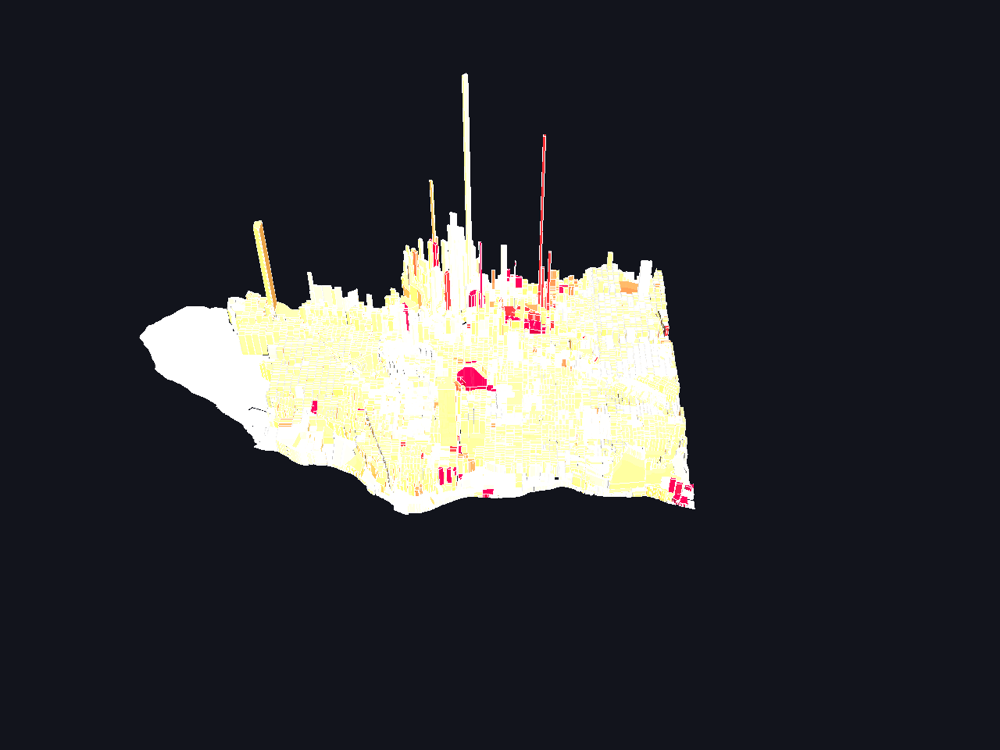
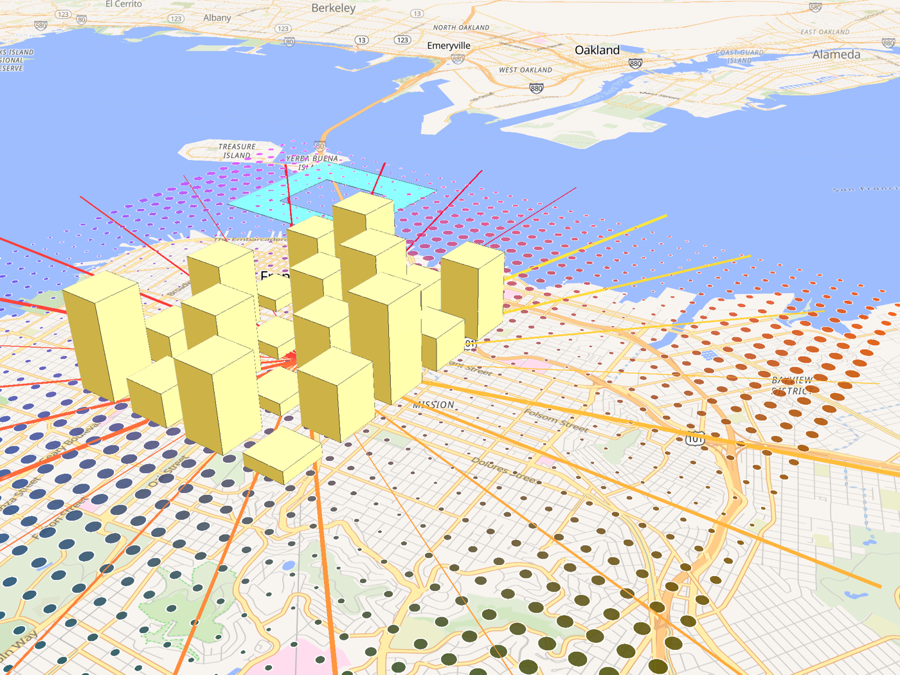

# deck.gl-native

A native implementation of [deck.gl](https://deck.gl) for native hardware: Rust on
[wgpu](https://wgpu.rs), rendering with deck.gl's own WGSL shaders and taking Apache Arrow
and GeoArrow data directly.

This is an independent project by [Birk Skyum](https://github.com/birkskyum). It is not
affiliated with Unfolded, vis.gl or the deck.gl maintainers, although it builds on their work:
the layer designs, the WGSL shaders and the projection math are ports of
[deck.gl](https://github.com/visgl/deck.gl) and [luma.gl](https://github.com/visgl/luma.gl),
and the repository started from the 2020 C++ prototype that Unfolded, Inc. published as
[UnfoldedInc/deck.gl-native](https://github.com/UnfoldedInc/deck.gl-native). That prototype
is kept in `cpp/` as a reference and described in [docs/cpp-prototype.md](docs/cpp-prototype.md).
The Rust port in `crates/` is a fresh port of deck.gl 9 and is the active code base.

Planned work is tracked in the [roadmap issue](https://github.com/birkskyum/deck.gl-native/issues/75)
and the [issue list](https://github.com/birkskyum/deck.gl-native/issues).

## Status

Working today, headless and verified pixel by pixel in tests:

- `ScatterplotLayer`, `LineLayer`, `SolidPolygonLayer` (filled, extruded, wireframe, holes), `PathLayer` (joints, caps, billboard), `ArcLayer`, `BitmapLayer`, `IconLayer`, `TextLayer` (font atlas from any TrueType font, SDF outlines, backgrounds, wrapping), `ColumnLayer`, `GridCellLayer`, `PointCloudLayer`, the composite `PolygonLayer` and `GeoJsonLayer`, the aggregation layers `HexagonLayer`, `GridLayer` and `ScreenGridLayer` (CPU binning, sum/mean/min/max/count, quantize/linear/quantile/ordinal scales, percentile cutoffs) and `HeatmapLayer` (GPU weights texture with additive and max blending, colour ramp texture), `ContourLayer` (marching squares isolines and isobands over the grid aggregation), and `TripsLayer` and `GreatCircleLayer` from `@deck.gl/geo-layers`
- `GlobeView`, `OrthographicView`, `OrbitView` and `FirstPersonView` next to the map view, with their viewports and view states, plus a `GlobeController` and an `OrbitController` (also for the orthographic view) with deck.gl's gestures
- Web Mercator viewport math ported from `@math.gl/web-mercator` and tested against it, with repeated world copies across the antimeridian (`DeckProps::repeat`) and `wrapLongitude` shortest paths
- deck.gl's `project` and `project32` shader modules, picking uniforms, `LightingEffect` with ambient, directional and point lights, and a per-layer `material`
- Arrow record batches as layer data, with column, constant and function accessors
- Rendering into any caller-owned `wgpu` render pass, or into textures you provide, with
  multisampling when the render target asks for it (the examples default to 4x)
- Picking (`Deck::pick` returns layer, object index and coordinate), per-object highlighting, `autoHighlight`, and `onHover` and `onClick` callbacks per layer and per deck driven by `Deck::pointer_move` and `Deck::click`
- Per-layer render `parameters`: blend state, depth test and writes, face culling
- `Deck::snapshot` reads a frame back as RGBA pixels (and saves PNGs with the `png` feature); the C API has `deckgl_snapshot` and `deckgl_snapshot_png`
- A `MapController` with deck.gl's gestures: drag to pan with inertia, rotate and pitch, zoom
  around the cursor, keyboard moves, zoom and pitch limits, and view state transitions
  (`FlyToInterpolator`'s van Wijk and Nuij flight path and linear interpolation, with deck.gl's
  interruption modes; also on `Deck::fly_to` for decks without a controller). Independent of
  the windowing library; the window example wires it to winit.
- `Deck::set_layers` reconciles by id: a layer re-sent with the same id and type keeps its GPU
  resources, and attributes are only rebuilt when its props changed
- A GeoJSON reader (`FeatureCollection`) feeding `GeoJsonLayer`; deck.gl's Vancouver blocks
  example (4,600 extruded polygons) parses and renders in under 50 ms
- JSON descriptions in the `@deck.gl/json` and pydeck format, with `@@=` accessor expressions
  and data from inline rows, files, URLs or named Arrow tables. See [docs/json.md](docs/json.md).
- A C API that takes JSON layers and Arrow tables through the Arrow C Data Interface, so a host
  in any language can feed columnar data without copying it.



- Rendering into a maplibre-native map, depth interleaved with its 3D buildings, either inside
  maplibre-native's own Metal backend through a C API, or from an all-Rust host through
  maplibre-native-ffi. See [docs/maplibre-native.md](docs/maplibre-native.md).
- The C API library cross-compiles for iOS (`cargo build --target aarch64-apple-ios -p deck-gl-ffi`).

Not yet: transitions, controllers, and the wider layer catalog. See
[docs/rust-port.md](docs/rust-port.md) for the design and the open decisions.



*maplibre-native's GLFW app on Metal with deck.gl-native layers drawn into the same frame.*

## Crates

| Crate | JavaScript counterpart | Contents |
| --- | --- | --- |
| `math-gl` | `@math.gl/web-mercator` | Web Mercator projection and camera math, f64 |
| `luma-gl` | `@luma.gl/core`, `@luma.gl/shadertools` | Shader assembly, uniform blocks, textures, `Model`, headless device helpers |
| `deck-gl` | `@deck.gl/core` | `Deck`, `Layer`, `Viewport`, the `project` shader module, Arrow data accessors |
| `deck-gl-layers` | `@deck.gl/layers`, `@deck.gl/aggregation-layers`, `@deck.gl/geo-layers` | `ScatterplotLayer`, `LineLayer`, `SolidPolygonLayer`, `PathLayer`, `ArcLayer`, `BitmapLayer`, `IconLayer`, `TextLayer`, `ColumnLayer`, `GridCellLayer`, `PointCloudLayer`, `PolygonLayer`, `GeoJsonLayer`, `HexagonLayer`, `GridLayer`, `ScreenGridLayer`, `TripsLayer`, `GreatCircleLayer` |
| `deck-gl-json` | `@deck.gl/json` | JSON descriptions (pydeck format) with expression accessors |
| `deck-gl-ffi` | `@deck.gl/mapbox` | C API (`libdeckgl.a`) for host renderers; Metal device and texture interop; JSON layers |
| `deck-gl-examples` | | Example binaries |

Shader sources under `src/wgsl` in each crate are copied from deck.gl 9.4 and luma.gl (MIT).

## Building and running

Requires a stable Rust toolchain (1.87 or newer) and a GPU with Metal, Vulkan or DirectX 12.

```sh
cargo test --workspace                     # unit tests plus headless GPU render tests
cargo run --release --bin texture_render   # renders the example scene to target/texture-render.png
cargo run --release --bin window           # the same scene in a window, with hover highlighting
cargo run --release --bin geojson -- file.geojson   # any GeoJSON file, extruded and colored by properties
cargo run --release --bin json_render -- examples/json/san-francisco.json out.png   # a JSON description to a PNG
DECKGL_JSON=examples/json/vancouver-blocks.json cargo run --release --bin window   # any example, from a JSON description
DECKGL_ONLY=trips,labels cargo run --release --bin texture_render   # only the listed layer ids
cargo run --release --manifest-path examples/maplibre-ffi/Cargo.toml   # on a maplibre-native basemap
```

## Using the library

```rust
use deck_gl::{Accessor, Deck, DeckProps, LayerData, LayerProps, ViewState};
use deck_gl_layers::{ScatterplotLayer, ScatterplotLayerProps};

let layer = ScatterplotLayer::new(ScatterplotLayerProps {
    base: LayerProps::new("points"),
    data: LayerData::from_batch(record_batch),      // an arrow RecordBatch
    get_position: Accessor::column("geometry"),     // FixedSizeList<f64, 2 | 3>
    get_fill_color: Accessor::column("color"),      // FixedSizeList<u8, 3 | 4>
    get_radius: Accessor::Constant(50.0),           // meters
    ..Default::default()
});

let mut deck = Deck::new(&device, &queue, render_target, DeckProps {
    width, height,
    view_state: ViewState { longitude: -122.4, latitude: 37.8, zoom: 12.0, pitch: 45.0, bearing: 0.0 },
    layers: vec![Box::new(layer)],
    ..Default::default()
})?;

// Either let the deck begin a pass on your textures...
deck.render(&mut encoder, &color_view, Some(&depth_view), Some(wgpu::Color::TRANSPARENT))?;
// ...or draw into a pass you already own, for instance a basemap's:
deck.update()?;
deck.draw(&mut render_pass)?;
```

`Deck::set_viewport` accepts a caller-built `Viewport`, which is how a host map renderer will
drive the deck camera from its own.

The same scene as a JSON description, the format pydeck and deck.gl's JSON playground use:

```rust
let json = deck_gl_json::JsonConverter::parse_file("scene.json")?;
deck.set_layers(json.layers);
```

```json
{
  "layers": [{
    "@@type": "ScatterplotLayer",
    "data": "points.geojson",
    "getPosition": "@@=geometry.coordinates",
    "getFillColor": "@@=properties.count > 10 ? [255, 0, 0] : [0, 0, 255]",
    "getRadius": 50
  }]
}
```

## Credits and license

deck.gl, luma.gl and math.gl are MIT licensed projects of the vis.gl community under the
OpenJS Foundation; their shader and projection code is reused here under that license, with
the original copyright notices kept in the source files. The 2020 C++ prototype by Unfolded,
Inc. is MIT licensed as well. This repository is MIT licensed.
