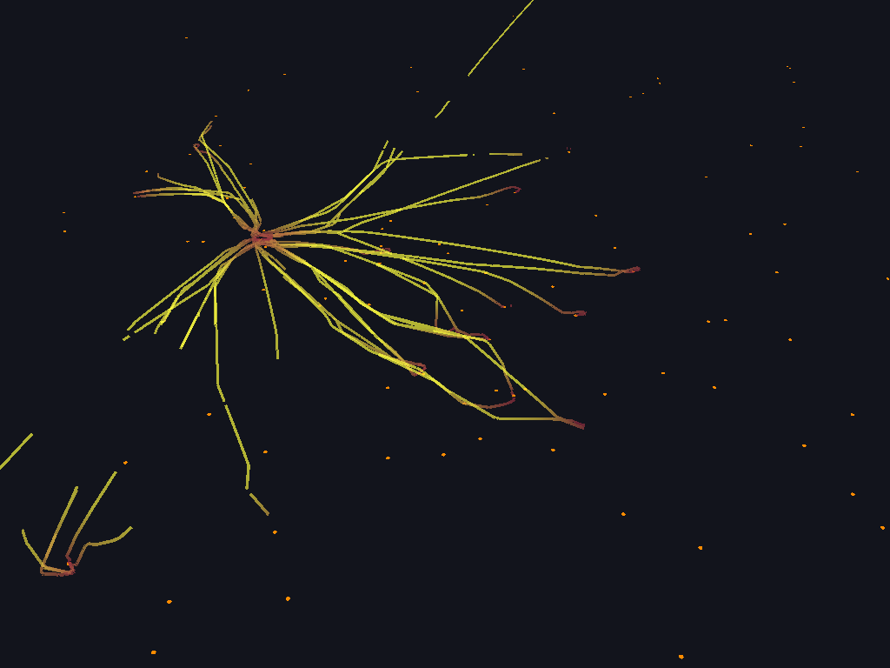

# JSON descriptions

`deck-gl-json` reads the JSON format of [`@deck.gl/json`](https://deck.gl/docs/api-reference/json/overview)
and [pydeck](https://pydeck.gl): a description with `initialViewState` and `layers`, where each
layer names its class with `@@type` and uses deck.gl's camelCase props. Descriptions written for
deck.gl's JSON playground or exported from pydeck work unchanged as long as the layers exist here.

```json
{
  "initialViewState": {"longitude": -122.42, "latitude": 37.775, "zoom": 12, "pitch": 45},
  "layers": [
    {
      "@@type": "ScatterplotLayer",
      "id": "stops",
      "data": [{"coordinates": [-122.47, 37.77], "passengers": 1500}],
      "pickable": true,
      "getPosition": "@@=coordinates",
      "getRadius": "@@=passengers / 10",
      "getFillColor": "@@=passengers > 2000 ? [255, 80, 80] : [255, 200, 80]"
    }
  ]
}
```

## Using it

```rust
let json = deck_gl_json::JsonConverter::parse_file("scene.json")?;
for warning in &json.warnings {
    eprintln!("{warning}");            // unknown layer types and props, like deck.gl's console warnings
}
let mut deck = Deck::new(&device, &queue, target, DeckProps {
    view_state: json.view_state.unwrap_or_default(),
    layers: json.layers,
    ..Default::default()
})?;
```

`JsonConverter::parse` takes text, `convert` takes a `serde_json::Value`, and both accept a bare
array of layers as well as a full description. `parse_file` resolves relative paths against the
file's directory; use `JsonConverter::with_base_dir` for text from elsewhere.

Every example binary reads `DECKGL_JSON=path/to/description.json` and shows that instead of the
built-in scene, and `json_render` renders a description straight to a PNG:

```sh
cargo run --release --bin json_render -- examples/json/san-francisco.json out.png 1600x1200
DECKGL_JSON=examples/json/vancouver-blocks.json cargo run --release --bin window
DECKGL_JSON=examples/json/heathrow-flights.json cargo run --release --manifest-path examples/maplibre-ffi/Cargo.toml
```



*deck.gl's LineLayer website example, from `examples/json/heathrow-flights.json`.*

Over the C API, `deckgl_set_layers_json(deck, json, base_dir)` and
`deckgl_load_json_file(deck, path)` do the same for a host renderer; maplibre-native's GLFW
overlay reads `DECKGL_JSON` too.

## Data

`data` is an inline array of rows, a GeoJSON object (its features become the rows), or a
string naming a local file or an `http(s)` URL of JSON, GeoJSON, CSV, TSV (`.csv`, `.tsv`, by
extension; a header row names the fields and cells become numbers, booleans, `null` or text) or
newline delimited JSON (`.ndjson`, `.jsonl`). URLs need the crate's default `fetch` feature. `image` (BitmapLayer) and `iconAtlas` (IconLayer) are PNG or JPEG files or URLs, and
`iconMapping` is an inline object or a JSON file.

### GeoParquet, Parquet and FlatGeobuf

A `data` string ending in `.parquet` (or `.geoparquet`), or `.fgb`, is read as a file or
URL. GeoParquet and FlatGeobuf files become GeoJSON features: a `GeoJsonLayer` draws them as
they are, and every other layer sees one row per feature with `geometry` and `properties`
for its accessors (`"getPosition": "@@=geometry.coordinates"`). Geometries are decoded from
WKB, with Z and M coordinates and EWKB SRIDs accepted. A Parquet file without GeoParquet
metadata is an Arrow table, read with `@@column:` accessors like the named tables below. The
`parquet` and `flatgeobuf` cargo features of `deck-gl-json` (on by default) provide this.

## Arrow tables

Large data should not go through JSON. A converter can carry named Arrow record batches, and
a layer uses one with `"data": "@@table:<name>"`. Accessors on table data name columns:
`"@@column:geometry"`, or just `"@@=geometry"`; expressions are not evaluated over tables.
Column types follow `deck-gl`'s Arrow accessors: positions are `FixedSizeList<f64, 2 | 3>`,
colours `FixedSizeList<u8, 3 | 4>`, numbers any numeric type, strings `Utf8`.

```rust
let converter = deck_gl_json::JsonConverter::new().with_table("points", record_batch);
```

Over the C API the table crosses the [Arrow C Data Interface](https://arrow.apache.org/docs/format/CDataInterface.html)
without copying its buffers: `deckgl_set_arrow_table(deck, "points", &schema, &array)` takes a
struct array whose fields are the columns, then `deckgl_set_layers_json` describes the layers.

## Accessors and expressions

An accessor prop is either a constant (`"getRadius": 5`, `"getFillColor": [255, 0, 0]`) or a
string starting with `@@=`, which is an expression evaluated for every row. The expression
language is the one `@deck.gl/json` uses (jsep): field access with `.` and `[]`, array literals,
arithmetic, comparisons, `&&`, `||`, `!`, the `?:` conditional, and JavaScript coercion rules.
Function calls are rejected. `@@=-` and `this` refer to the row itself.

```
"getPosition": "@@=coordinates"
"getPosition": "@@=[lng, lat, altitude || 0]"
"getElevation": "@@=properties.valuePerSqm"
"getFillColor": "@@=properties.growth > 0.2 ? [255, 120, 60] : [199, 233, 180]"
"getIcon": "@@='marker-' + kind"
```

Expressions are evaluated once when the description is converted, and every row must produce
a value of the prop's type (a position is 2 or 3 numbers, a color 3 or 4 channels in 0..255, a
polygon a ring or an array of rings). Errors name the layer, the prop and the row.

Enumerations use `@@#`: `"coordinateSystem": "@@#COORDINATE_SYSTEM.METER_OFFSETS"` (the plain
number deck.gl uses also works). Units are strings: `"radiusUnits": "pixels"`.

## Views

A top level `views` array may hold a `MapView` (the default; its `repeat` flag makes the deck
draw extra copies of the world when the view spans the antimeridian), a `GlobeView`
(`resolution`, `nearZMultiplier`, `farZMultiplier`, `altitude`; the same `initialViewState` as
the map, switching to the map above zoom 12), an `OrthographicView`
(`near`, `far`, `flipY`), an `OrbitView` (`orbitAxis`, `fovy`, `near`, `far`, `orthographic`) or
a `FirstPersonView` (`fovy`, `near`, `far`, `focalDistance`). `initialViewState` is read for the
chosen view: `target`, `zoom`, `zoomX`, `zoomY` for the orthographic view; `target`, `zoom`,
`rotationOrbit`, `rotationX` for the orbit view; `longitude`, `latitude`, `position`, `bearing`,
`pitch` for the first person view. Layers in the non map views use cartesian coordinates.
Several views render into their own rectangles: each view takes `id`, `x`, `y`, `width`,
`height` (pixels or `"30%"`) and `padding` (`left`, `right`, `top`, `bottom`), and
`initialViewState` may then be an object keyed by view id. `examples/json/minimap.json` shows a
map with a minimap in the corner.

## Effects

A top level `effects` array may hold a `LightingEffect`, whose other fields are the lights, each
with its own `@@type` (`AmbientLight`, `DirectionalLight` or `PointLight`) and deck.gl's props
(`color`, `intensity`, `direction`, `position`, `attenuation`). It replaces the default lighting
for the whole description; a description without an `AmbientLight` has no ambient term.
Other effect types produce a warning and are skipped.

```json
{
  "effects": [
    {
      "@@type": "LightingEffect",
      "ambient": {"@@type": "AmbientLight", "color": [255, 255, 255], "intensity": 1.0},
      "sun": {"@@type": "DirectionalLight", "color": [255, 255, 255], "intensity": 2.0, "direction": [-3, -9, -1]}
    }
  ],
  "layers": [{"@@type": "SolidPolygonLayer", "extruded": true, "material": {"ambient": 0.64, "diffuse": 0.6, "shininess": 32, "specularColor": [51, 51, 51]}, "...": "..."}]
}
```

## Extensions

deck.gl's `extensions` prop takes a list of extension objects, and the extension's own props
sit on the layer, as in pydeck:

```json
{
  "@@type": "ScatterplotLayer",
  "data": "...",
  "extensions": [{"@@type": "DataFilterExtension", "filterSize": 1, "categorySize": 1}],
  "getFilterValue": "@@=value",
  "filterRange": [20, 80],
  "filterSoftRange": [30, 70],
  "getFilterCategory": "@@=kind",
  "filterCategories": ["bus", "metro"]
}
```

| Extension | Options and props |
| --- | --- |
| `DataFilterExtension` | options `filterSize` (0 to 4 values per object) and `categorySize` (0 to 4 categories per object); props `getFilterValue`, `filterRange` (`[min, max]`, or one pair per value), `filterSoftRange`, `filterEnabled`, `filterTransformSize`, `filterTransformColor`, `getFilterCategory` (names or numbers, mapped to keys in order of appearance), `filterCategories` (the categories shown, one list per category channel). `fp64` and `countItems` are accepted and ignored. `examples/json/data-filter.json` filters points by value and kind. |
| `BrushingExtension` | `getBrushingTarget`, `brushingTarget` (`source`, `target`, `source_target`, `custom`), `brushingEnabled`, `brushingRadius` (metres); the pointer comes from `deckgl_pointer_move` or `Deck::pointer_move` |
| `ClipExtension` | `clipBounds` (`[left, bottom, right, top]`), `clipByInstance` (by default whole objects for point like layers, trimmed geometry for path, polygon, GeoJSON, bitmap and tile layers) |
| `MaskExtension` | `maskId` (the id of a layer with `"operation": "mask"`), `maskByInstance` (same default as `clipByInstance`), `maskInverted` |
| `CollisionFilterExtension` | `getCollisionPriority` (-1000 to 1000, higher wins), `collisionEnabled`, `collisionGroup` (`collisionTestProps` is accepted and ignored) |
| `FillStyleExtension` | option `pattern`; `fillPatternAtlas` (image path or URL), `fillPatternMapping` (`{name: {x, y, width, height}}`, inline or a JSON file), `fillPatternMask`, `fillPatternEnabled`, `getFillPattern`, `getFillPatternScale`, `getFillPatternOffset` |
| `PathStyleExtension` | options `dash` and `offset` (`highPrecisionDash` is accepted and ignored); `getDashArray`, `getOffset`, `dashJustified`, `dashGapPickable`; dashes circle strokes on a `ScatterplotLayer` |

Extension attributes work on every layer but the bitmap and screen grid layers, which report
an error for them. See [docs/extensions.md](extensions.md) for the shader hook
convention behind this.

## Supported layers and props

| Layer | Props |
| --- | --- |
| all layers | `id`, `visible`, `opacity`, `pickable`, `coordinateSystem`, `coordinateOrigin`, `modelMatrix`, `wrapLongitude`, `highlightColor`, `highlightedObjectIndex`, `autoHighlight`, `material` (`true`, `false` for unlit, or `{ambient, diffuse, shininess, specularColor}`), `parameters` (`depthTest`, `depthWriteEnabled`, `depthCompare`, `cullMode`, `blend`, `blendColorOperation`, `blendColorSrcFactor`, `blendColorDstFactor`, `blendAlphaOperation`, `blendAlphaSrcFactor`, `blendAlphaDstFactor`, with luma.gl's WebGPU names), `extensions` (see [Extensions](#extensions)), `operation` (`draw`, or `mask` for a layer that only defines a mask) |
| `ScatterplotLayer` | `radiusUnits`, `radiusScale`, `radiusMinPixels`, `radiusMaxPixels`, `lineWidthUnits`, `lineWidthScale`, `lineWidthMinPixels`, `lineWidthMaxPixels`, `stroked`, `filled`, `billboard`, `antialiasing`, `getPosition`, `getRadius`, `getFillColor`, `getLineColor`, `getLineWidth`, `getPixelOffset` |
| `LineLayer` | `widthUnits`, `widthScale`, `widthMinPixels`, `widthMaxPixels`, `getSourcePosition`, `getTargetPosition`, `getColor`, `getWidth` |
| `ArcLayer` | `greatCircle`, `numSegments`, `widthUnits`, `widthScale`, `widthMinPixels`, `widthMaxPixels`, `getSourcePosition`, `getTargetPosition`, `getSourceColor`, `getTargetColor`, `getWidth`, `getHeight`, `getTilt` |
| `PathLayer` | `widthUnits`, `widthScale`, `widthMinPixels`, `widthMaxPixels`, `jointRounded`, `capRounded`, `miterLimit`, `billboard`, `getPath`, `getColor`, `getWidth` |
| `TripsLayer` | all `PathLayer` props plus `getTimestamps` (one per path vertex), `currentTime`, `trailLength`, `fadeTrail` |
| `GreatCircleLayer` | the `ArcLayer` props, drawn as flat great circles |
| `SolidPolygonLayer` | `filled`, `extruded`, `wireframe`, `elevationScale`, `getPolygon`, `getElevation`, `getFillColor`, `getLineColor` |
| `PolygonLayer` | `stroked`, `filled`, `extruded`, `wireframe`, `elevationScale`, `lineWidthUnits`, `lineWidthScale`, `lineWidthMinPixels`, `lineWidthMaxPixels`, `lineJointRounded`, `lineMiterLimit`, `getPolygon`, `getFillColor`, `getLineColor`, `getLineWidth`, `getElevation` |
| `GeoJsonLayer` | `filled`, `stroked`, `extruded`, `wireframe`, `elevationScale`, `lineWidthUnits`, `lineWidthScale`, `lineWidthMinPixels`, `lineWidthMaxPixels`, `lineJointRounded`, `lineCapRounded`, `lineMiterLimit`, `pointRadiusUnits`, `pointRadiusScale`, `pointRadiusMinPixels`, `pointRadiusMaxPixels`, `getFillColor`, `getLineColor`, `getLineWidth`, `getPointRadius`, `getElevation` |
| `ColumnLayer` | `diskResolution`, `radius`, `angle`, `offset`, `coverage`, `elevationScale`, `radiusUnits`, `lineWidthUnits`, `lineWidthScale`, `lineWidthMinPixels`, `lineWidthMaxPixels`, `extruded`, `wireframe`, `filled`, `stroked`, `getPosition`, `getFillColor`, `getLineColor`, `getLineWidth`, `getElevation` |
| `HexagonLayer`, `GridLayer` | `radius` / `cellSize`, `getPosition`, `getColorWeight`, `getElevationWeight`, `colorAggregation`, `elevationAggregation` (`SUM`, `MEAN`, `MIN`, `MAX`, `COUNT`), `colorRange`, `colorDomain`, `colorScaleType`, `elevationDomain`, `elevationRange`, `elevationScale`, `elevationScaleType`, `lowerPercentile`, `upperPercentile`, `elevationLowerPercentile`, `elevationUpperPercentile`, `extruded`, `coverage` (CPU aggregation; `gpuAggregation` is accepted and ignored) |
| `ContourLayer` | `cellSize`, `gridOrigin`, `aggregation` (`SUM`, `MEAN`, `MIN`, `MAX`), `contours` (`threshold` as a number for an isoline or `[min, max]` for an isoband, `color`, `strokeWidth`, `zIndex`), `zOffset`, `getPosition`, `getWeight` (CPU grid aggregation and marching squares; `gpuAggregation` is accepted and ignored) |
| `H3HexagonLayer`, `S2Layer`, `GeohashLayer`, `QuadkeyLayer` | all `PolygonLayer` props plus `getHexagon` / `getS2Token` / `getGeohash` / `getQuadkey` (the cell index of each row) and `coverage` (H3 and quadkey); `H3HexagonLayer` is extruded by default (`highPrecision` and `centerHexagon` are accepted and ignored: cells are always drawn as exact polygons) |
| `MVTLayer` | `data` (tile URL template(s) for `.pbf` / `.mvt`, gzip accepted), the `TileLayer` zoom, extent and request props, `layers` (source layer names to keep) and all `GeoJsonLayer` styling props; every feature gets a `layerName` property (`binary`, `uniqueIdProperty`, `highlightedFeatureId`, `loaders` are accepted and ignored) |
| `WMSLayer` | `data` (a WMS endpoint, or a URL template with `{west}`, `{south}`, `{east}`, `{north}`, `{bbox}`, `{width}`, `{height}`, `{layers}`, `{crs}` when `serviceType` is `template`), `layers`, `srs` (`EPSG:3857` or `EPSG:4326`), `format`, `transparent`, `debounceTime`; one image for the visible area, requested again once the view settles (the load callbacks are accepted and ignored) |
| `TileLayer` | `data` (a URL template with `{z}`, `{x}` and `{y}` or `{-y}`, or a list of them), `tileSize`, `minZoom`, `maxZoom`, `zoomOffset`, `extent`, `refinementStrategy` (`best-available`, `no-overlap`, `never`), `maxCacheSize`, `maxRequests`; image tiles are loaded in the background and drawn as bitmaps (`examples/json/osm-tiles.json`; mind the tile server's usage policy) |
| `HeatmapLayer` | `radiusPixels`, `intensity`, `threshold`, `colorRange`, `colorDomain`, `aggregation` (`SUM` or `MEAN`), `weightsTextureSize`, `getPosition`, `getWeight` (GPU aggregation into a float texture, re-run when the view leaves the aggregated area or the zoom changes; `debounceTimeout` is accepted and ignored) |
| `ScreenGridLayer` | `cellSizePixels`, `cellMarginPixels`, `getPosition`, `getWeight`, `aggregation`, `colorRange`, `colorDomain`, `colorScaleType` (`linear` or `quantize`); re-aggregated in screen space whenever the view changes |
| `GridCellLayer` | `cellSize`, `coverage`, `elevationScale`, `extruded`, `getPosition`, `getFillColor`, `getElevation` |
| `PointCloudLayer` | `sizeUnits`, `pointSize`, `getPosition`, `getNormal`, `getColor` |
| `TextLayer` | `getText`, `getPosition`, `getColor`, `getSize`, `getAngle`, `getTextAnchor`, `getAlignmentBaseline`, `getPixelOffset`, `sizeScale`, `sizeUnits`, `sizeMinPixels`, `sizeMaxPixels`, `billboard`, `background`, `getBackgroundColor`, `getBorderColor`, `getBorderWidth`, `backgroundPadding`, `backgroundBorderRadius`, `characterSet` (`"auto"`, a string or an array), `fontFamily` (a `.ttf`/`.otf` path or URL; CSS families fall back to the bundled Roboto Mono), `fontSettings` (`sdf`, `fontSize`, `buffer`, `radius`, `cutoff`, `smoothing`), `lineHeight`, `outlineWidth`, `outlineColor`, `wordBreak`, `maxWidth` |
| `IconLayer` | `iconAtlas`, `iconMapping`, `sizeUnits`, `sizeScale`, `sizeMinPixels`, `sizeMaxPixels`, `billboard`, `alphaCutoff`, `getPosition`, `getIcon`, `getColor`, `getSize`, `getAngle`, `getPixelOffset` |
| `BitmapLayer` | `image`, `bounds` (`[left, bottom, right, top]` or four corners), `desaturate`, `transparentColor`, `tintColor` |

Props deck.gl accepts but this port does not have yet (`transitions`, `pointType`, ...)
produce a warning and are skipped, as are layer types that do not exist here yet. Callbacks such as `onHover` and `updateTriggers` are ignored silently since they
have no meaning in a static description.
