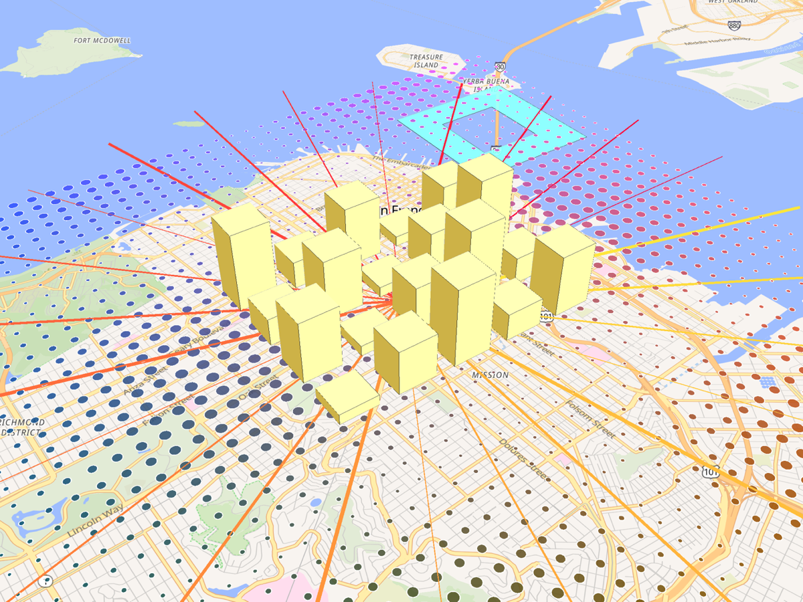

# deck.gl-native inside maplibre-native


*The maplibre-native GLFW demo app (Metal, OpenFreeMap Liberty style) with deck.gl-native's
scatterplot, line and extruded polygon layers drawn into the same frame.*

This is the interleaved rendering path: maplibre-native draws the map, deck.gl-native draws its
layers into the same drawable and depth texture, on the same Metal command queue, and the
frame is presented once. No texture copies, no compositing pass.

## How it works

`crates/deck-gl-ffi` builds `libdeckgl.a` with a small C API (`include/deckgl.h`):

1. `deckgl_metal_create(id<MTLDevice>, id<MTLCommandQueue>)` creates a wgpu device on the
   host's Metal device through wgpu's hal layer, using the host's command queue. Everything
   deck submits is committed on that queue, so it runs after whatever the host committed
   before it.
2. `deckgl_set_camera` receives the map camera each frame: center, zoom, bearing, pitch,
   field of view, the host's near and far planes in pixels, padding, roll, the elevation of the
   centre (terrain) or the host's own projection matrix, the viewport size and the pixel
   ratio. deck builds a `WebMercatorViewport` from it the way `@deck.gl/mapbox` does, so
   projection and depth match the map.
3. `deckgl_metal_render(color, depth, clear_depth)` wraps the host's `MTLTexture`s as wgpu
   textures without copying, loads the color contents, and draws the layers.

The host side for the GLFW demo app lives in the maplibre-native tree
(`platform/glfw/deckgl_overlay.{hpp,mm}`, snapshotted with the patch in
[hosts/maplibre-native-glfw](../hosts/maplibre-native-glfw/)) behind the CMake option
`MLN_DECKGL_OVERLAY`:

- `GLFWView::render` passes `map->getCameraOptions()` to the overlay before each frame.
- `MetalRenderableResource::swap` commits the map's command buffer, calls the overlay, then
  presents the drawable from a third command buffer.

## Running

```sh
scripts/run-maplibre-demo.sh ~/repos/maplibre-monorepo/maplibre-native
```

The overlay draws whenever the map draws a frame, so it follows every pan, zoom and rotate.
Pass `--benchmark` to the app for continuous rendering. The script builds `libdeckgl.a`,
configures maplibre-native's `macos-metal` preset with the overlay enabled and starts the app
over San Francisco. On this machine two workarounds were needed and the script applies them:
the Homebrew ccache cannot start, and maplibre-tile-spec's FastPFOR needs the simde headers
and `SIMDE_ENABLE_NATIVE_ALIASES` on the include path.

Interleaving works by sharing the map's depth buffer: the hook keeps the depth attachment
cleared at load and stored after the map's pass, and deck projects with the same near and far
planes maplibre uses for its 3D layers (a near plane of a tenth of the camera distance, see
`maplibre_near_far_pixels`) and writes OpenGL style depth values like maplibre does
(`ClipDepthRange::NegativeOneToOne`). Ground level deck geometry therefore sits under buildings and
above the flat map layers, and elevated geometry such as arcs and extruded polygons is occluded
only by taller buildings. Labels are still drawn under deck's layers; putting deck between map
layers needs the custom layer host tracked in issue #61.

Environment variables read by the overlay:

| Variable | Effect |
| --- | --- |
| `DECKGL_OVERLAY=0` | Disable the overlay |
| `DECKGL_JSON=scene.json` | Show a [JSON description](json.md) instead of the demo scene (also honoured by the all-Rust demo below) |
| `DECKGL_LOAD_DEPTH=0` | Clear depth before deck draws instead of depth testing against the map's buildings (interleaving is the default) |
| `DECKGL_DEBUG=1` | Print the camera, planes and viewport deck derives from the map |
| `DECKGL_DUMP_DEPTH=/tmp/prefix` | Write the map's depth buffer as raw `f32` once and print building feet against deck's ground depth (see hosts/maplibre-native-glfw/README.md) |
| `DECKGL_SCREENSHOT=frame.png` | Write the composited frame to a PNG once, `DECKGL_SCREENSHOT_AFTER_MS` (default 8000) after the first frame |

## All-Rust host through maplibre-native-ffi



`examples/maplibre-ffi` is the same demo with no C++ at all. It uses the Rust bindings from
[maplibre-native-ffi](https://github.com/maplibre/maplibre-native-ffi), whose build script
downloads the prebuilt `maplibre-native-c` library for the platform.

- wgpu owns the window and one color texture.
- maplibre-native renders the map into that texture through the FFI's caller-owned Metal
  texture target (`attach_metal_borrowed_texture`). That render waits for the GPU before it
  returns, so nothing else is needed to order the two renderers.
- deck draws its layers into the same texture, with the camera read back from the map and
  maplibre's near and far planes, then wgpu copies the texture to the swapchain.

```sh
git clone https://github.com/maplibre/maplibre-native-ffi ../maplibre-native-ffi
cargo run --release --manifest-path examples/maplibre-ffi/Cargo.toml
```

The crate is a standalone workspace member so the main workspace builds without the native
download. It expects the maplibre-native-ffi checkout next to this repository.

Left drag pans, right drag or ctrl+drag rotates and pitches, scroll zooms at the cursor, Q
and E rotate, plus and minus zoom, 0 resets the camera. The map orbits on its own until the
first interaction.

The runtime and the map run on their own thread, as in maplibre-native-ffi's `rust-map`
example: pumping the runtime from a winit callback spins the Cocoa run loop re-entrantly and
winit panics. The map thread also drives the orbit and publishes the camera; the winit thread
attaches the render session, renders and presents.

## Status and next steps

- The demo scene is the same as the headless example: extruded blocks, a scatterplot fed from
  Arrow columns and radiating lines, centered on San Francisco.
- Camera parity uses maplibre-native's near and far plane formulas from
  `TransformState::getProjMatrix`. Padding, roll and terrain elevation are not yet handled.
- The same C API is the basis for iOS (`MLNMapView` custom layers) and for the Vulkan backend
  on Android, where wgpu's Vulkan hal offers the same raw-handle imports.
- With the WebGPU backends of maplibre-native (Dawn or wgpu-native), deck could share the
  `WGPUDevice` directly. That path needs deck.gl-native to be built against `webgpu.h`
  instead of the `wgpu` crate, which is a separate decision.
